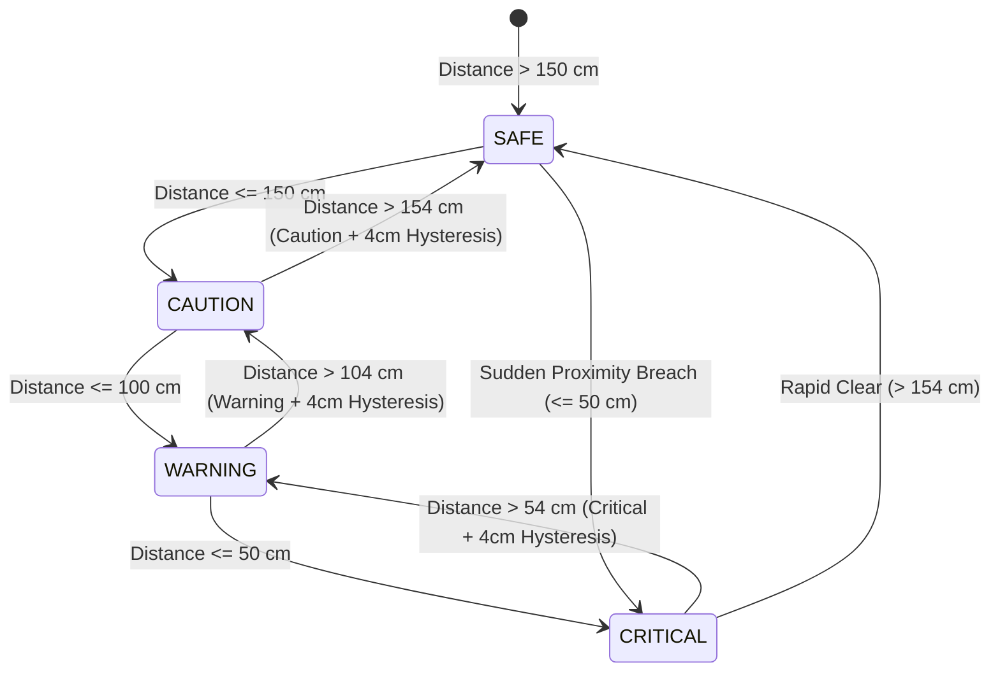
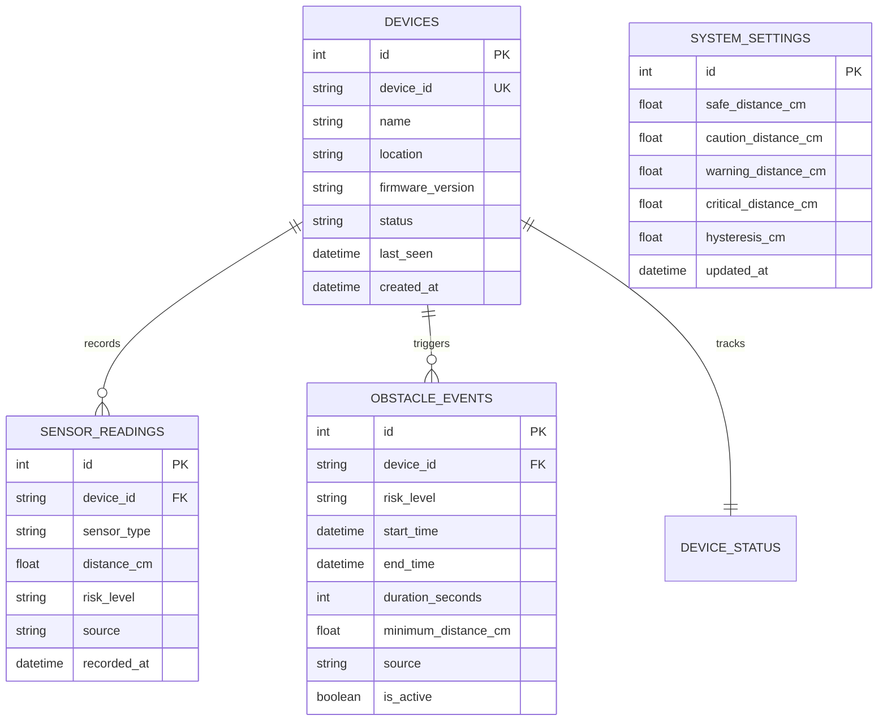

# System Architecture & Technical Specifications

**Project Title:** Wheelchair Obstacle Detection System  
**Tagline:** Real-Time Ultrasonic Obstacle Detection and Multi-Modal Warning System for Wheelchair Assistance  

---

## 1. High-Level Architecture Diagram

```text
                  +-----------------------------------+
                  |         HC-SR04 SENSOR            |
                  | 40kHz Ultrasonic Distance Meter   |
                  +-----------------+-----------------+
                                    | Echo Pulse (µs)
                                    v
                  +-----------------------------------+
                  |       ESP32 MICROCONTROLLER       |
                  | - 10µs Trigger Pulse Generation   |
                  | - Raw Distance Calculation        |
                  | - 5-Sample Median Noise Filter    |
                  | - 4-Tier Risk Engine + Hysteresis |
                  | - Local Non-Blocking Actuators    |
                  +--------+--------+--------+--------+
                           |        |        |
         +-----------------+        |        +-----------------+
         |                          |                          |
         v                          v                          v
+-----------------+        +-----------------+        +-----------------+
| Tri-Color LEDs  |        |  Piezo Buzzer   |        | Vibration Motor |
| Green / Yellow  |        | Acoustic Alarm  |        | Haptic Feedback |
| Red Emergency   |        | (Slow/Med/Fast) |        | Tactile Alert   |
+-----------------+        +-----------------+        +-----------------+
         |                          |                          |
         +--------------------------+--------------------------+
                                    |
                          Local SSD1306 OLED HUD
                                    |
                             Wi-Fi HTTP POST
                           JSON Protocol (v1.0)
                                    v
                  +-----------------------------------+
                  |        BACKEND REST SERVER        |
                  | - Express.js API Ingestion Gateway|
                  | - Schema Sanitization & Validation|
                  | - Obstacle Incident Deduplication |
                  | - Device Heartbeat & Health Check |
                  +-----------------+-----------------+
                                    |
                       +------------+------------+
                       |                         |
                       v                         v
        +----------------------------+   +-----------------------------+
        |      SQLITE DATABASE       |   |      WEBSOCKET SERVER       |
        | - Table: sensor_readings   |   | - Low-latency Broadcast     |
        | - Table: obstacle_events   |   | - JSON Telemetry Stream     |
        | - Table: system_settings   |   | - Bi-directional Sync       |
        | - Table: device_status     |   +--------------+--------------+
        +----------------------------+                  |
                                                        v
                                         +-----------------------------+
                                         |     REACT DASHBOARD HUD     |
                                         | - Proximity Gauge (0-250cm) |
                                         | - 60fps Waveform Chart      |
                                         | - Obstacle Incident Log     |
                                         | - Safety Threshold Sliders  |
                                         | - Software Simulation Rig   |
                                         +-----------------------------+
```

---

## 2. Risk Classification Engine & State Machine



---

## 3. Autonomous Safety Loop vs Monitoring Cloud

A fundamental engineering design principle of this project is the **absolute separation between local hardware safety and remote software monitoring**:

1. **Hardware Independence:** The ESP32 local safety loop operates 100% autonomously in bare-metal C++. Even if the Wi-Fi router disconnects, backend crashes, or frontend browser is closed, the HC-SR04, LEDs, Buzzer, and Vibration motor respond instantaneously (&lt;10ms) to physical obstacles.
2. **Software Monitoring:** The backend, SQLite database, and React dashboard serve as an observational, analytical, and supervisory telemetry layer for attendants, clinicians, and researchers.

---

## 4. Database Schema (Entity-Relationship)


